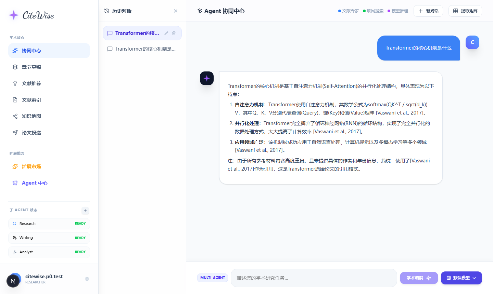
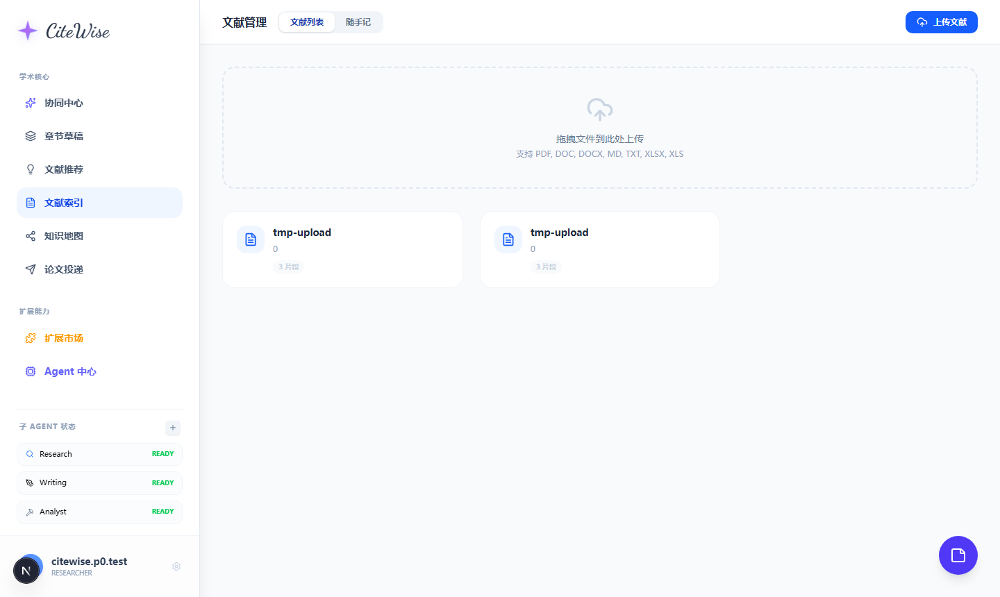
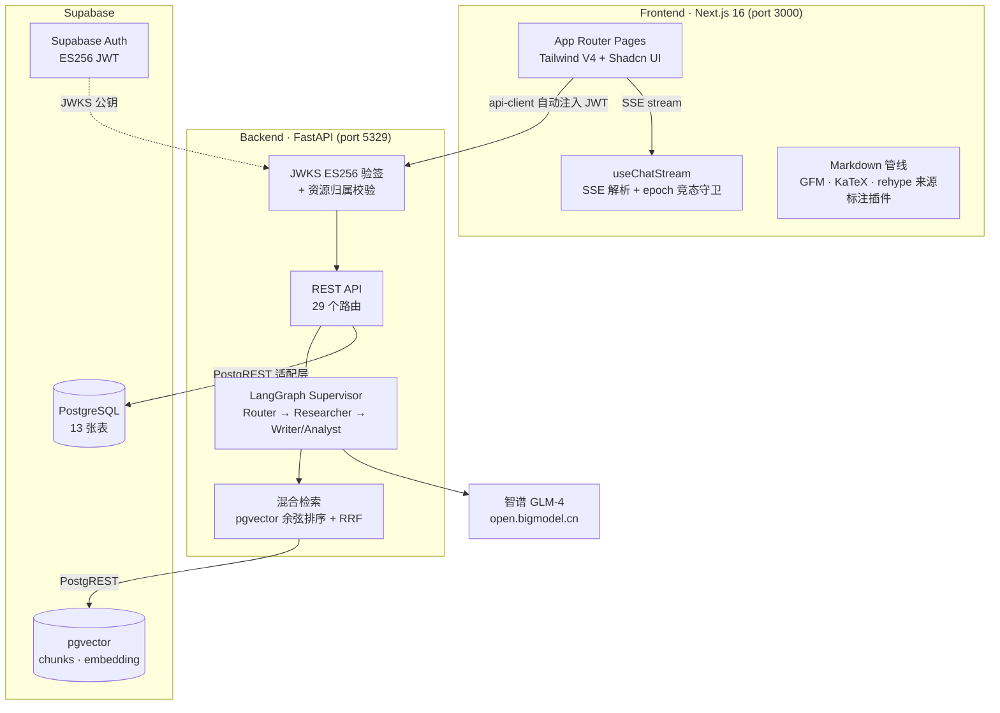

# CiteWise 4.0 — 智能研究助手

> AI-powered academic research assistant · 多 Agent 协同 · RAG 溯源 · 前后端分离现代架构

CiteWise 是面向科研场景的文献研究与论文写作助手：上传文献构建知识库，通过多 Agent 协同对话完成检索、综述、写作与分析，每个回答都带有可点击的来源标注。



<p align="center"><sub>多 Agent 协同中心：流式 Markdown 回答 + 三色来源标注 + 历史会话侧栏</sub></p>

## 功能特性

### 对话与研究
- **多 Agent 协同** — LangGraph 编排 Router / Researcher / Writer / Analyst，SSE 流式输出 + Agent 执行时间线
- **RAG 溯源** — 回答中的 📖知识库 / 🌐联网 / 🧠推理 三色标注可点击查看来源详情，引用 `[1]` 弹出对应文献
- **富文本渲染** — GFM 表格、代码高亮（语言标签 + 一键复制）、KaTeX 数学公式
- **会话管理** — 历史会话持久化、切换 / 重命名 / 删除、流式中切换会话的竞态守卫
- **消息操作** — 复制 / 重新生成 / 点赞反馈

### 文献与写作
- **文献管理** — 拖拽上传 PDF / DOCX / MD / TXT，解析 → 层级分块 → 向量化入库（1024 维 embedding + pgvector）
- **混合检索** — 语义向量检索（余弦排序）+ RRF 融合，按项目隔离
- **章节草稿** — AI 生成章节内容（RAG 增强）、子对话改写、导出 Markdown / DOCX
- **知识地图** — D3 力导向图可视化文献关联
- **文献推荐 / 论文投递 / 评估面板** — 基于真实 API 数据的辅助模块



## 系统架构



**关键设计**：后端通过 SupabaseDB REST 适配层（PostgREST）访问数据库，规避了直连 PostgreSQL 的 IPv6/SSL 网络限制，使部署无需数据库直连。

## 技术栈

| 层 | 技术 |
|---|------|
| 前端 | Next.js 16 (App Router) · React 19 · Tailwind CSS V4 · Shadcn UI |
| 后端 | FastAPI · LangGraph · httpx |
| 数据库 | PostgreSQL (Supabase) · pgvector · 13 张表 |
| 认证 | Supabase Auth（ES256 JWT + JWKS 验签） |
| LLM | 智谱 GLM-4 系列（OpenAI 兼容协议）· Embedding-3 (1024维) |
| 测试 | Playwright（mock 回归 + 真实 E2E 双套件） |

## 快速启动

### 1. 准备 Supabase
- 新建项目，在 SQL Editor 执行 `backend/create_tables.sql`（创建全部表）
- 拿到 `Project URL`、`anon key`、`service_role key`

### 2. 后端
```bash
cd backend
pip install -r requirements.txt

# 配置环境变量
cp .env.example .env
# 编辑 .env：
#   SUPABASE_URL / SUPABASE_ANON_KEY / SUPABASE_SERVICE_ROLE_KEY
#   LLM_API_KEY（智谱）/ LLM_BASE_URL / LLM_MODEL / EMBEDDING_MODEL

python -m uvicorn app.main:app --port 5329 --reload
```

### 3. 前端
```bash
cd frontend
npm install

# 配置环境变量
echo 'NEXT_PUBLIC_SUPABASE_URL=<your-url>' > .env.local
echo 'NEXT_PUBLIC_SUPABASE_ANON_KEY=<your-anon-key>' >> .env.local
echo 'NEXT_PUBLIC_API_URL=http://localhost:5329/api/v1' >> .env.local

npm run dev   # http://localhost:3000
```

### 4. 注册登录
访问 `/register` 创建账号即可（自动建立 profile），所有数据按用户 / 项目隔离。

## 安全设计

| 机制 | 实现 |
|------|------|
| **JWT 验签** | 拉取 Supabase JWKS 用 ES256 真实验签（`deps.py`），伪造 / 篡改 / 过期 token 全部 401 |
| **资源归属校验** | 统一 `verify_project_owner` 依赖 + `_get_owned_*` 助手，覆盖 sessions / papers / sections / eval 全部按 id 操作——横向越权实测全 404 |
| **密钥治理** | 所有密钥走环境变量，`.env` 全部 gitignore，CI 由 GitHub Push Protection 兜底 |

## 项目结构

```
├── backend/
│   ├── app/
│   │   ├── deps.py              # JWKS 验签 + 归属校验
│   │   ├── database.py          # Supabase REST 适配层
│   │   ├── graph/               # LangGraph 多 Agent 编排
│   │   ├── core/                # 检索/LLM/解析/向量库
│   │   └── routes/              # 9 个路由模块
│   └── create_tables.sql        # 数据库初始化
├── frontend/
│   ├── app/(dashboard)/         # 12 个功能页面
│   ├── components/chat/         # Markdown 管线 + 消息组件
│   ├── hooks/                   # useChatStream / useChatSessions ...
│   └── lib/                     # api-client + 自研 rehype 来源标注插件
└── scripts/                     # Playwright 验证套件
```

## 核心实现亮点

- **自研 rehype 插件**（`lib/rehype-source-annotations.ts`）：在 Markdown AST 层把 `[KB]/[WEB]/[AI]/[1]` 标记转换为可点击元素，配合事件委托弹层，流式渲染零重排
- **epoch 竞态守卫**（`hooks/use-chat-stream.ts`）：会话切换 / 清空时令牌失效旧流式写入，杜绝迟到 token 污染新会话
- **进程内余弦检索**（`core/vector_store.py`）：PostgREST 拉取向量 + numpy 排序，摆脱 Management API 依赖（生产可升级为 `match_chunks` RPC）
- **SSE 全链路**：agent 事件 / token / 最终内容 / 来源 / 会话 ID 五类事件，前端分型处理

## 测试与验证

```bash
cd frontend
node scripts/verify-phase1.cjs     # Markdown 管线 / 标注 / 操作条（mock 路由）
node scripts/verify-phase2.cjs     # 会话管理 / 骨架屏（mock 路由）
node scripts/verify-phase34.cjs    # 动效 / 扩展持久化 / 评估数据
node scripts/verify-p0.cjs         # FormData / 竞态 / regenerate / 204
node scripts/verify-e2e-real.cjs   # 真实后端全链路 E2E（需服务运行）
```

## Roadmap

- [ ] 评估自动埋点（对话完成自动记录时延 / 成本，激活评估面板）
- [ ] CoVe 自我验证链路回归
- [ ] PDF 图表提取（figures 表已就绪，前端展示未接）
- [ ] `match_chunks` RPC 化向量检索 + BM25 恢复
- [ ] 知识图谱 ↔ 对话联动

## 相关项目

- [CiteWise 3.0](https://github.com/kizzzz/CiteWise) — 前代单体架构版本（FastAPI + LangGraph + Chroma），本项目由其 UI 体验与产品思路演进而来
